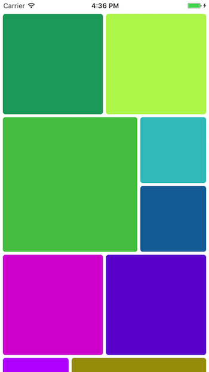

# MLWTiledLayout

[](https://travis-ci.org/Andrew Podkovyrin/MLWTiledLayout)
[](http://cocoapods.org/pods/MLWTiledLayout)
[](https://github.com/Carthage/Carthage)
[](http://cocoapods.org/pods/MLWTiledLayout)
[](http://cocoapods.org/pods/MLWTiledLayout)

`MLWTiledLayout` is `UICollectionViewLayout` subclass that implements tiled layout or mosaic layout automagically adopted to any iPhone screen size.
The layout is column-based and inspired by [lightbox layout algorithm](http://blog.vjeux.com/2012/image/image-layout-algorithm-lightbox.html).



## Example

To run the example project, clone the repo, and run `pod install` from the Example directory first.

## Requirements

iOS 8.0

## Installation

MLWTiledLayout is available through [CocoaPods](http://cocoapods.org). To install
it, simply add the following line to your Podfile:

```ruby
pod "MLWTiledLayout"
```

Or, if you’re using [Carthage](https://github.com/Carthage/Carthage), simply add MLWTiledLayout to your `Cartfile`:

```
github "ML-Works/MLWTiledLayout"
```

## Author

Andrew Podkovyrin, podkovyrin@mlworks.com

## License

MLWTiledLayout is available under the MIT license. See the LICENSE file for more info.
